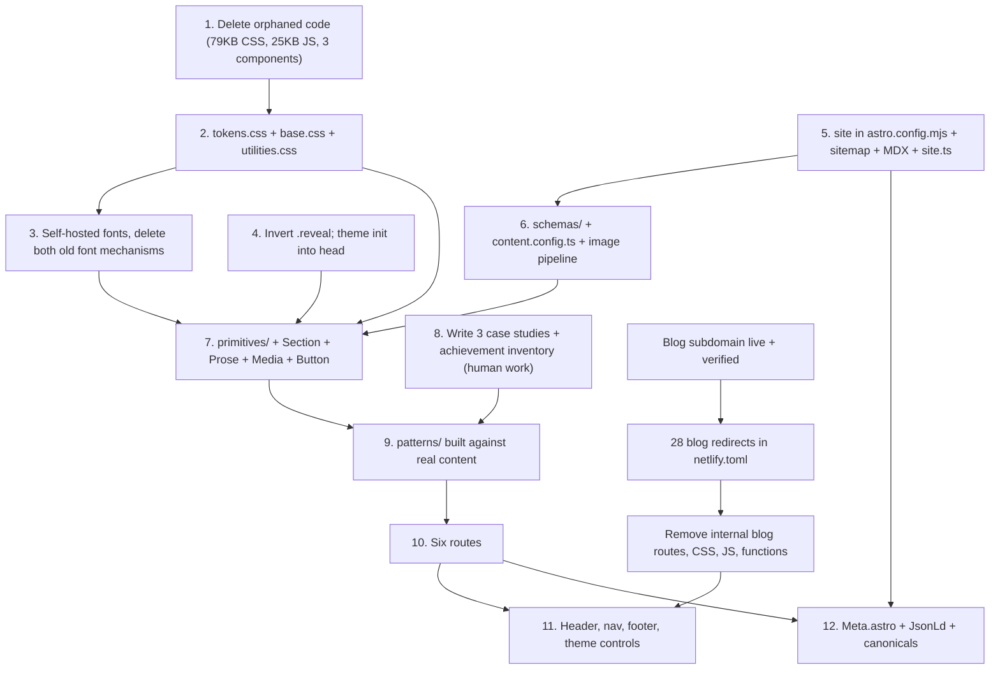

# Beyond The Basics — Content Architecture & Design System

Status: specification, not yet implemented. Written after the repository audit and the approved information architecture.
Scope: the implementation-level content model, visual design system, and component architecture for the redesigned site.

This document is the single source of truth for tokens, type, spacing, and component contracts. When it disagrees with code, the code is wrong.

## What this supersedes

Three files currently declare overlapping design tokens. On implementation, all three token layers collapse into one:

- `src/styles/style.css` lines 20-118 — the live `:root`, dark override, and ten `data-palette` blocks
- `src/styles/global.css` lines 20-29 — a second `:root` redeclaring fonts and accents
- `src/styles/tokens.css` — 379 lines that nothing imports; its spacing, type, and measure scales are harvested here, its glass/blob/atmosphere tokens are not

## Decisions already taken

- **Typography direction:** editorial serif headings, neutral sans body, mono metadata. Six families across two loading mechanisms collapse to three self-hosted faces.
- **Colour system:** light and dark themes plus three curated accents, retuned to restrained values. The ten-palette switcher (`neon`, `sunset`, `crimson`...) is retired; the switching *mechanism* is kept.

## Non-negotiables

1. **The site must be excellent with animations disabled.** Motion is additive only. Every layout, hierarchy, and affordance must read correctly with `prefers-reduced-motion: reduce`, with JavaScript off, and with all transitions stripped.
2. **Content is visible without JavaScript.** This inverts the current `.reveal { opacity: 0 }` in `spectacular.css` line 283, which today makes every page header, card, bio, form, and footer invisible until `public/js/scroll.js` runs.
3. **Presentation is independent of content.** Adding a project means adding one file. No page UI changes, no new component, no edit to the index or the homepage.
4. **One name per value.** No aliases, no second token file, no duplicate `:root`. The audit's core finding was "two of everything"; the design system's job is to choose one of each.
5. **Accent is scarce.** Three accents times two themes is six combinations to verify. That is only affordable because accent appears in a small, fixed set of roles.

---

# A. Content schemas

## A0. The organising rule

> **Frontmatter holds anything another page needs, or anything that needs validation. The body holds prose and images. Components bridge the two.**

This one rule resolves every "where does this field live" question:

- The project title, outcome line, stack, status, year, and thumbnail appear on the index and the homepage, so they are frontmatter.
- "Why I Built It" appears only on the case study, so it is body prose.
- Journey entries need coerced dates and chronological sorting, so they are frontmatter even though only the case study renders them.
- Gallery images need relative-path optimisation and inline alt text, so they are body Markdown inside a `<Gallery>` wrapper.

## A1. Collections and where data lives

```
src/
  content.config.ts          # collection definitions (Astro 5 Content Layer)
  schemas/
    primitives.ts            # link, timelineEntry, metric, mediaRatio — shared shapes
    project.ts               # project schema factory
    achievement.ts
    now.ts
    writing.ts
  content/
    projects/
      personal-website/
        index.mdx
        media/*.jpg|png|webp
      french-coach/
      robot/
  data/
    achievements.yaml        # file() loader, 10+ entries
    writing.yaml             # file() loader, exactly 3 curated picks
    now.yaml                 # file() loader, single entry
    timeline.yaml            # file() loader, optional About timeline (deferred)
  config/
    site.ts                  # identity, URLs, email, Formspree id, socials
```

Two structural notes:

- Migrate from the legacy `src/content/config.ts` to `src/content.config.ts` using the Content Layer `glob()` and `file()` loaders. The existing `blog` collection stays untouched until the subdomain is verified, then is deleted with the routes.
- Shared schemas live in `src/schemas/` and import `z` from `astro/zod`, not `astro:content`, so the same definitions can validate plain TypeScript data modules. Fields needing `image()` or `reference()` are injected by a schema *factory* called from `content.config.ts`, because those helpers only exist in collection context.

## A2. Shared primitives

```ts
// src/schemas/primitives.ts
import { z } from 'astro/zod';

/** Every outbound link on the site, including socials and evidence links. */
export const link = z.object({
  label: z.string().min(1),
  href: z.string().url(),
  kind: z
    .enum(['repo', 'live', 'demo', 'writeup', 'video', 'download', 'profile', 'certificate'])
    .default('live'),
});

/** One dated moment. Used by project journeys and the optional About timeline. */
export const timelineEntry = z.object({
  date: z.coerce.date(),
  end: z.coerce.date().optional(),
  title: z.string().min(1),
  detail: z.string().optional(),
});

/** A verifiable number. `note` exists so a figure can never appear unsourced. */
export const metric = z.object({
  label: z.string().min(1),
  value: z.string().min(1),
  note: z.string().optional(),
});

export type Link = z.infer<typeof link>;
export type TimelineEntry = z.infer<typeof timelineEntry>;
export type Metric = z.infer<typeof metric>;
```

`z.coerce.date()` is used for every date on the site. This is the direct fix for the current blog schema's `z.string()` date field, which produced three incompatible formats across 28 files and unguarded `NaN` sorts in `index.astro` and `blog/[slug].astro`.

## A3. Project

```ts
// src/schemas/project.ts
import { z } from 'astro/zod';
import type { SchemaContext } from 'astro:content';
import { link, metric, timelineEntry } from './primitives';

export const projectSchema = ({ image }: SchemaContext) =>
  z
    .object({
      // Identity — slug comes from the directory name, never a field
      title: z.string().min(1),
      outcome: z.string().max(90),            // one line, <= 12 words, index + homepage
      summary: z.string().min(80).max(320),   // 2-4 sentences, also the meta description
      kicker: z.string().max(40).optional(),  // small label above the title

      // Classification
      category: z.enum(['web', 'ai', 'hardware', 'tool']),
      status: z.enum(['shipped', 'in-progress', 'experiment', 'archived']),
      year: z.number().int().min(2020).max(2100),
      timeframe: z.string().optional(),       // "Mar - Aug 2025"
      role: z.string().default('Designer & developer'),
      collaborators: z.array(z.string()).default([]),
      stack: z.array(z.string()).min(1).max(8),

      // Ordering and lifecycle
      order: z.number().int(),                // manual curation; not date-sorted
      draft: z.boolean().default(false),

      // Media — alt is required by construction, never optional
      thumbnail: z.object({ src: image(), alt: z.string().min(4) }),
      hero: z.object({ src: image(), alt: z.string().min(4) }).optional(),

      // Structured blocks the body places via components
      metrics: z.array(metric).max(4).default([]),
      journey: z.array(timelineEntry).default([]),
      specs: z.array(z.object({ label: z.string(), value: z.string() })).default([]),

      // Outbound and cross-links
      links: z.array(link).default([]),
      linksNote: z.string().optional(),       // required when links is empty
      achievement: z.string().optional(),     // achievement id this project produced
      relatedPost: z.object({ title: z.string(), url: z.string().url() }).optional(),

      // SEO override; defaults to `summary`
      description: z.string().max(160).optional(),
    })
    .refine((p) => p.links.length > 0 || Boolean(p.linksNote), {
      message: 'A project needs at least one link, or linksNote explaining why nothing is public.',
      path: ['links'],
    });
```

### Fields deliberately not implemented

The brief listed a longer field set. Four were dropped because the existing architecture offers something better:

- **`slug`** — the directory name is the slug. A `slug` field lets frontmatter and URL drift apart, which is exactly how the blog ended up with 26 numeric URLs.
- **`featured`** — with three projects, everything is featured. The homepage shows all three in `order`. Reintroduce `featured` past eight projects, alongside grouping.
- **`subtitle` / `description` as separate prose fields** — collapsed into `outcome` (one line, for cards) and `summary` (2-4 sentences, for the page lede and the meta description). Three overlapping prose fields is how you end up writing the same sentence three ways.
- **`technologies`** — named `stack`, matching the "stack chips" language of the IA and the way it renders.
- **`sections` as a frontmatter array** — see below.

### The section model

Sections are **composed in the body, not declared in frontmatter**. Projects are `.mdx`, and `src/pages/projects/[slug].astro` renders:

```
[ header from frontmatter ]  title, kicker, outcome, spec block, links
[ hero media, if present ]
[ table of contents, generated from entry.headings, only if >= 4 h2s ]
[ <Content components={caseStudyComponents} /> ]   <- the whole narrative
[ next project + back to index ]
```

The body is free-form Markdown H2 sections plus placed components:

```mdx
## Overview

Two to four sentences.

## Why I Built It

Motivation and stakes in one section. This deliberately merges the brief's separate
"Problem", "Why I Built It", and "Initial Idea" headings, which produce padding when split.

<Metrics items={frontmatter.metrics} />

## Architecture

<Gallery caption="Chassis iterations, June to August">


</Gallery>

<Journey entries={frontmatter.journey} />

## What I Learned

<SpecSheet items={frontmatter.specs} />
```

Why this shape:

- **Simple projects stay simple.** `personal-website` is prose plus `<Gallery>` plus frontmatter links. No empty headings, no skeleton of unused sections.
- **Deep case studies compose.** `robot` places `<Journey>` mid-page and `<SpecSheet>` as a bill of materials; `french-coach` places `<Metrics>` after Results and never uses `<Gallery>`.
- **Order is per project, comparability is preserved by convention** rather than enforced by a fixed template. The IA fixes a canonical order; the model does not need to.
- **Structured data stays validated.** Journeys, metrics, and specs are Zod-checked frontmatter; the body only positions them.
- **Images stay optimisable.** Relative Markdown images inside `<Gallery>` are processed by Astro's image pipeline with alt text written inline, next to the image it describes.

Cost of this model: one dependency, `@astrojs/mdx`, and the components map must be passed at the single render site. Components are supplied through `<Content components={...} />` so no case study file needs import statements. If that binding proves brittle on the installed Astro version, the fallback is a one-line import block per file — verify during implementation.

The sanctioned component set for case-study bodies, and nothing else: `Metrics`, `Gallery`, `Figure`, `Journey`, `Decisions`, `Challenges`, `SpecSheet`, `Aside`, `Callout`.

## A4. Achievement

```ts
// src/schemas/achievement.ts
import { z } from 'astro/zod';
import { link } from './primitives';

export const achievementSchema = z.object({
  title: z.string().min(1),
  issuer: z.string().min(1),                  // awarding body — mandatory, no self-awarded items
  date: z.coerce.date(),
  domain: z.enum(['academics', 'music', 'sport', 'leadership', 'building']),
  credential: z.string().optional(),          // "Grade 8, High Distinction"
  significance: z.string().min(40).max(220),  // required: why this is hard
  highlight: z.boolean().default(false),      // Selected Highlights, cap 5
  evidence: z.array(link).default([]),
  project: z.string().optional(),             // project slug this produced or came from
});
```

Three enforcement decisions:

- **`significance` is required with a 40-character floor.** The IA is explicit that the note matters more than the title: "LCM Grade 8, High Distinction" means nothing to an admissions officer without "pre-diploma standard, reached after roughly five years of graded exams." A schema that allows an empty significance note allows a weak achievements page.
- **`issuer` is required.** This is what structurally excludes the current "Learning & Growing / Ongoing" filler entry, since aspiration has no issuing body.
- **No `icon` or `gradient` fields.** The current `achievements.astro` stores inline SVG strings and CSS gradients in the data array. Icons and gradients are presentation; storing them in content is what makes content and UI inseparable.

Stored as a single YAML file, `src/data/achievements.yaml`, loaded with `file()`. One file keeps 10+ short entries scannable and reorderable in one edit. If the installed Astro version's `file()` loader does not natively parse YAML, pass an explicit `parser` or switch the file to JSON — verify during implementation.

```yaml
- id: lodha-genius-2025
  title: Lodha Genius Programme
  issuer: Ashoka University
  date: 2025-06-01
  domain: academics
  significance: >-
    A selective residential programme at Ashoka University for students identified
    through national testing; four weeks of university-level coursework taught by
    faculty rather than school teachers.
  highlight: true
  evidence:
    - label: Programme overview
      href: https://www.ashoka.edu.in/lodha-genius-programme/
      kind: profile

- id: lcm-grade-8-guitar
  title: Guitar, Grade 8
  issuer: London College of Music
  date: 2025-01-01
  domain: music
  credential: High Distinction
  significance: >-
    Pre-diploma standard, reached after roughly five years of graded examinations,
    including a solo performance programme at annual concerts.
  highlight: true
```

## A5. Now / Currently

```ts
// src/schemas/now.ts
import { z } from 'astro/zod';

export const nowSchema = z.object({
  updated: z.coerce.date(),
  focus: z.string().min(40).max(280),       // 2-4 lines: the active project
  learning: z.array(z.string()).max(3).default([]),
  project: z.string().optional(),           // slug of the project being worked on
});
```

The homepage band renders `focus`, up to three `learning` items, and a visible "Updated {Month YYYY}" stamp. The stamp is not decoration: it is the honesty mechanism that makes a Currently band safe to ship where a `/now` route was not.

Add a staleness guard at build time: if `updated` is more than 90 days old, log a build warning. A stale Currently band is worse than none, and the only reliable reminder is a noisy build.

## A6. Writing picks

```ts
// src/schemas/writing.ts
import { z } from 'astro/zod';

export const writingPickSchema = z.object({
  title: z.string().min(1),
  url: z.string().url(),                    // absolute, always the subdomain
  date: z.coerce.date(),
  excerpt: z.string().min(60).max(240),
  why: z.string().max(120).optional(),      // optional one-line editorial note
});
```

Exactly three entries in `src/data/writing.yaml`, hand-picked, absolute URLs to `blog.beyondthebasics.me`. No fetch, no RSS parse, no build-time coupling to the blog's availability. Curation is the feature: an automatic latest-posts feed would greet an admissions officer with an Arsenal transfer headline.

Enforce the count where it renders, not in the schema, so a fourth entry fails loudly rather than silently truncating.

## A7. Site identity and links

```ts
// src/config/site.ts
export const site = {
  name: 'Beyond The Basics',
  author: 'Om Jhamvar',
  url: 'https://beyondthebasics.me',
  blogUrl: 'https://blog.beyondthebasics.me',
  email: 'omjhamvar29@gmail.com',
  tagline: 'Builder. Learner. Thinker.',
  description: '...',                       // default meta description
  ogImage: '/og/default.png',
  formspreeId: 'xzdajdnn',                  // carried across the rebuild
  socials: [
    { label: 'GitHub', href: 'https://github.com/<REAL_HANDLE>', kind: 'profile' },
    { label: 'LinkedIn', href: 'https://www.linkedin.com/in/<REAL_HANDLE>', kind: 'profile' },
  ],
} as const;
```

This single file resolves four current defects: the placeholder `https://twitter.com` and `https://github.com` URLs in `Footer.astro` lines 9 and 12, the Formspree endpoint hardcoded in `ContactForm.astro` markup, the hardcoded 2026 copyright, and the absence of a canonical site URL. The footer year comes from `new Date().getFullYear()`.

## A8. Adding a project — the presentation-independence test

If any step below requires touching a component or a page, the model has failed:

1. Create `src/content/projects/<slug>/index.mdx`.
2. Fill frontmatter. Zod rejects a missing outcome, an empty stack, a missing thumbnail alt, or links with no explanation.
3. Drop images into `src/content/projects/<slug>/media/`.
4. Write the body: H2 prose sections, plus any of the nine sanctioned components.
5. Set `order`.

The index reads `getCollection('projects')`, filters drafts, sorts by `order`, and maps over `ProjectRow`. The homepage does the same with `variant="compact"`. `[slug].astro` uses `getStaticPaths()`. Nothing is hardcoded — which is the direct correction of today's `projects.astro`, where two projects, their SVG icons, and their gradients are literals inside the page file.

---

# B. Design tokens

Token architecture is two tiers and one file, `src/styles/tokens.css`:

1. **Ramps** — raw values, never used directly in components (`--paper-*`, `--ink-*`, accent ramps).
2. **Semantic tokens** — the only names components may reference (`--surface-page`, `--text-primary`, `--border-hairline`).

Rule: if a component references a ramp value or a literal hex, that is a bug.

## B1. Colour system

The identity moves from **cold glass** to **warm paper and ink**. Current light mode is `#edf1f7` with cyan `#4cc9f0` glows, radial atmospheres, grain maps, and translucent surfaces. The target is an off-white warm paper, near-black warm ink, hairline rules, and a single deep accent.

Blue is **retained but re-roled** rather than preserved by default. It stops being a decorative cyan glow (`#4cc9f0`, used for glows, gradient text, and card rings) and becomes a deep print-ink blue used for links, the active nav marker, and one rule per section. This keeps continuity with the existing identity while making the restrained direction achievable.

### Neutral ramps

```css
:root {
  /* Paper — warm off-whites */
  --paper-0:  #ffffff;
  --paper-50: #fbfaf8;
  --paper-100:#f3f1ed;
  --paper-200:#e6e2db;
  --paper-300:#cfc9bf;

  /* Ink — warm near-blacks and greys */
  --ink-900: #0b0a09;
  --ink-800: #100f0e;
  --ink-700: #171614;
  --ink-600: #2a2825;
  --ink-500: #3d3a36;
  --ink-400: #6e6862;
  --ink-300: #857f76;
  --ink-200: #b5b0a8;
  --ink-100: #edeae4;
  --ink-050: #171512;   /* light-mode body ink */
}
```

### Accents — three, each a single hue with a defined role

| id | role | light | dark |
| --- | --- | --- | --- |
| `ink` (default) | links, active nav, one rule per section | `#1b3fa0` | `#9fc0ff` |
| `oxblood` | same roles, warmer register | `#8c2f39` | `#e8969c` |
| `ivy` | same roles, cooler register | `#265d45` | `#86c7a5` |

Applied via `data-accent` on `<html>`, persisted to `localStorage`, defaulting to `ink`. This reuses the existing switcher mechanism from `public/js/theme.js` while dropping `neon`, `sunset`, `rose`, `gold`, `lavender`, `crimson`, `midnight`, `ocean`, `emerald`, and `arctic`.

Approximate contrast against each theme's page surface, all comfortably above the 4.5:1 floor and above the 7:1 AAA target: light `ink` 8.5:1, `oxblood` 7.5:1, `ivy` 7.0:1; dark `ink` 10.5:1, `oxblood` and `ivy` around 9-10:1. Verify with a checker at implementation; do not adjust these by eye.

Where accent is permitted, exhaustively: prose link colour, link underline on hover, `aria-current` nav marker, one section rule or eyebrow per band, primary button fill, focus ring, the `shipped` status dot. Nowhere else. Specifically forbidden: gradient text (the current `PageHeader.astro` clips a two-accent gradient into the H1), glows, large fills, icon tiles, card borders at rest, blob backgrounds.

### Semantic tokens

```css
:root {
  /* Surfaces */
  --surface-page:    var(--paper-50);
  --surface-raised:  var(--paper-0);
  --surface-sunken:  var(--paper-100);   /* spec sheets, code, quiet bands, hover */

  /* Text */
  --text-primary:    var(--ink-050);
  --text-secondary:  #4a463f;
  --text-muted:      var(--ink-400);
  --text-on-accent:  #ffffff;

  /* Lines — the primary structural device */
  --border-subtle:      var(--paper-200);  /* decorative hairlines */
  --border-strong:      var(--paper-300);  /* meaningful boundaries */
  --border-interactive: var(--ink-400);    /* inputs, ghost buttons: >= 3:1 */

  /* Accent (default: ink) */
  --accent:          #1b3fa0;
  --accent-hover:    #16307c;
  --focus-ring:      #1b3fa0;

  /* Status — never the sole indicator, always paired with a text label */
  --status-shipped:  #2f6b4f;
  --status-progress: #8a5a12;
  --status-quiet:    var(--text-muted);

  /* Elevation — two only */
  --shadow-header:   0 1px 0 var(--border-subtle);
  --shadow-overlay:  0 24px 48px -24px rgb(0 0 0 / 0.35);

  /* Stacking */
  --z-base: 0; --z-raised: 10; --z-header: 100;
  --z-menu: 200; --z-overlay: 300; --z-toast: 400;
}
```

Deleted outright: `--glass-*` (24 tokens), `--blob-*`, `--page-atmosphere`, `--page-texture`, `--grain-map`, `--paper-map`, `--scanline-map`, `--card-hover-glow`, `--card-hover-ring`, `--card-hover-filter`, `--btn-primary-shadow`, `--motion-shadow`, `--motion-pulse-animation`, `--motion-flicker-animation`, `--category-reflection`, `--glass-prism-*`.

## B2. Light theme — "Paper"

Warm off-white `#fbfaf8` page, pure white for the rare raised surface, `#f3f1ed` for sunken bands. Body ink `#171512` at roughly 17:1. Structure comes from 1px `#e6e2db` hairlines, not from shadows or borders-plus-radius boxes. No background gradients, no texture overlay, no blobs. `color-scheme: light` so native form controls and scrollbars match.

## B3. Dark theme — "Ink"

Warm near-black `#100f0e`, not the current blue-black `#080c18`, so both themes share one temperature and the same photographs read correctly in each. Text `#edeae4` at roughly 16:1; secondary `#b5b0a8` at 8.9:1; muted `#857f76` at 4.8:1, which is the floor and must not be lightened further in the ramp without rechecking.

```css
html[data-theme='dark'] {
  color-scheme: dark;
  --surface-page:   var(--ink-800);
  --surface-raised: var(--ink-700);
  --surface-sunken: var(--ink-900);
  --text-primary:   var(--ink-100);
  --text-secondary: var(--ink-200);
  --text-muted:     var(--ink-300);
  --text-on-accent: var(--ink-800);
  --border-subtle:  var(--ink-600);
  --border-strong:  var(--ink-500);
  --border-interactive: #7a746b;
  --accent:         #9fc0ff;
  --accent-hover:   #c2d6ff;
  --focus-ring:     #9fc0ff;
  --status-shipped: #86c7a5;
  --status-progress:#e3b267;
  --shadow-header:  0 1px 0 var(--border-subtle);
}
```

Dark mode is not an inversion: hairlines get proportionally lighter, images are never filtered or dimmed, and the accent is a tint of the light-mode hue rather than the same value.

Two implementation requirements:

- **Theme init moves into `<head>`** as a tiny blocking inline script reading `localStorage` and setting `data-theme` plus `data-accent` before first paint. Today `public/js/theme.js` loads from `<body>`, which guarantees a light flash for every dark-mode user on every navigation.
- `<meta name="theme-color">` is emitted per theme so mobile browser chrome matches.

## B4. Spacing scale

Harvested from the unimported `tokens.css`, with the alias tier deleted:

```css
:root {
  --space-1:  0.25rem;  /*  4px */
  --space-2:  0.5rem;   /*  8px */
  --space-3:  0.75rem;  /* 12px */
  --space-4:  1rem;     /* 16px */
  --space-5:  1.5rem;   /* 24px */
  --space-6:  2rem;     /* 32px */
  --space-7:  3rem;     /* 48px */
  --space-8:  4rem;     /* 64px */
  --space-9:  6rem;     /* 96px */
  --space-10: 8rem;     /* 128px */

  --gutter:      clamp(1.25rem, 4vw, 2.5rem);   /* container inset */
  --section-gap: clamp(4rem, 9vw, 8rem);        /* between page bands */
  --block-gap:   var(--space-6);                /* between blocks inside a band */
}
```

`--space-2xs` through `--space-4xl` are not carried over. Two names for one value is how a token system starts disagreeing with itself.

Rules: vertical rhythm between bands comes only from `--section-gap`; everything else uses the ramp; no arbitrary pixel values in component styles; **no `!important` anywhere in the new CSS** — `index.astro` alone currently carries 14 for spacing alone.

## B5. Radius and border philosophy

> **Radius communicates interactivity, not decoration.**

```css
:root {
  --radius-0:    0;       /* media, figures, sections, bands — the default */
  --radius-sm:   2px;     /* buttons, inputs, chips, status badges */
  --radius-md:   4px;     /* blockquote and code block edges */
  --radius-full: 999px;   /* avatar and the theme toggle dot only */
}
```

Zero is the default. `--card-radius: 20px` and `--radius-pill: 100px` are retired: 20px boxes plus translucency plus shadow is the generic AI-landing-page look the brief rules out, and pill tags are the single clearest template tell.

Hairlines carry structure. A `1px solid var(--border-subtle)` rule spanning the container, with a mono section label in the left margin, is the primary sectioning device — replacing the current pattern of wrapping every content group in a `.glass-card`. `backdrop-filter` is used nowhere; the sticky header is a solid surface with a bottom hairline.

---

# C. Typography system

## C1. Families

- **Newsreader** (variable) — headings, ledes, pull quotes, project titles. Editorial, has a real italic, holds up at 14px and 64px.
- **Inter** (variable) — body prose, UI, buttons, navigation. Neutral and highly legible on screen at the 17-20px prose sizes this site uses.
- **JetBrains Mono** (variable) — metadata only: dates, years, status, stack chips, spec keys, figure numbers, reading time.

```css
:root {
  --font-display: 'Newsreader Variable', 'Iowan Old Style', 'Palatino Linotype', Georgia, serif;
  --font-body:    'Inter Variable', -apple-system, 'Segoe UI', Roboto, sans-serif;
  --font-mono:    'JetBrains Mono Variable', ui-monospace, 'SF Mono', Menlo, monospace;
}
```

Weights: Newsreader 400 / 500 / 600 plus italic 400. Inter 400 / 500 / 600. Mono 400 / 500. Nothing at 700 or above, and nothing below 400 — the current system uses Syne 800 for page titles, which reads shouty rather than authoritative.

Retired: Syne, DM Sans, DM Mono, Playfair Display, Lora, and all 32 `"NYT Cheltenham" / "NYT Imperial" / "NYT Franklin"` declarations, which are proprietary fonts that never loaded and silently fell back to Georgia and Arial.

## C2. Loading

Self-host through Fontsource (`@fontsource-variable/newsreader`, `@fontsource-variable/inter`, `@fontsource-variable/jetbrains-mono`) as devDependencies, imported once in the CSS entry.

This removes both current mechanisms: the `<link>` to Google Fonts in `BaseLayout.astro` line 25, and the `@import url(...)` at `style.css` line 8. The `@import` is the worse of the two — it is a serialised waterfall where the browser must fetch 127KB of CSS, parse it, discover the import, fetch Google's stylesheet, and only then fetch fonts.

Requirements: latin subset only; `font-display: swap`; `<link rel="preload">` for the two faces on the critical path (Inter variable, Newsreader variable); fallback metric matching via `size-adjust` on the fallback `@font-face` to hold layout shift near zero; total font budget **140KB**. Verify each variable package exists before relying on it, and fall back to static weights if not.

## C3. Type scale

Fluid with hard caps. One ramp, referenced by name.

```css
:root {
  --step--2: 0.75rem;                                        /* 12px  mono metadata */
  --step--1: 0.875rem;                                       /* 14px  captions, chips */
  --step-0:  clamp(1rem, 0.97rem + 0.15vw, 1.0625rem);       /* 16-17 UI, body base */
  --step-1:  clamp(1.125rem, 1.08rem + 0.22vw, 1.25rem);     /* 18-20 case-study prose, lede */
  --step-2:  clamp(1.375rem, 1.3rem + 0.4vw, 1.625rem);      /* 22-26 h3, project titles */
  --step-3:  clamp(1.75rem, 1.6rem + 0.7vw, 2.25rem);        /* 28-36 h2 */
  --step-4:  clamp(2.25rem, 1.95rem + 1.4vw, 3rem);          /* 36-48 h1 */
  --step-5:  clamp(2.75rem, 2.2rem + 2.6vw, 4rem);           /* 44-64 homepage hero only */

  --leading-tight:  1.1;    /* --step-4, --step-5 */
  --leading-snug:   1.25;   /* --step-2, --step-3 */
  --leading-normal: 1.5;    /* UI, cards, lists */
  --leading-prose:  1.65;   /* body prose */

  --tracking-tight:  -0.02em;  /* display sizes */
  --tracking-normal: 0;
  --tracking-mono:   0.08em;   /* uppercase mono labels */

  --measure-narrow: 46ch;   /* hero sentence, ledes */
  --measure-prose:  62ch;   /* case-study body */
  --measure-wide:   78ch;   /* spec sheets, wide lists */
}
```

The ramp caps at 64px, and only the homepage hero may use it. No page title exceeds 48px. Combined with the ban on animated text, this rules out the huge-animated-headline pattern the brief excludes.

## C4. Hierarchy rules

- Exactly one `<h1>` per page. No skipped levels. Kickers and eyebrows are `<p>` or `<span>`, never headings — a mono uppercase label at `--step--2` must not appear in the document outline.
- Page pattern: H1, one-line purpose in `--step-1` at `--measure-narrow`, then the page's single most important element. No decorative hero consumes a viewport on any page except the homepage.
- Serif for anything that is a title or a quote; sans for anything that is read continuously or clicked; mono only for facts. A word set in mono is a claim of precision.
- Prose scope: `--step-1` / `--leading-prose` / `--measure-prose`, paragraph spacing `1em`, H2 with `--space-8` above and `--space-3` below, blockquote as Newsreader italic `--step-2` with a 2px left rule in `--border-strong` — not accent, not centred, no oversized quote glyph.
- `font-variant-numeric: tabular-nums` on all metrics, dates, and spec values so columns align.
- Never letter-space lowercase body text; never justify; never centre a paragraph longer than two lines.

---

# D. Component hierarchy

## D1. Layers

A component earns its existence if it has variants or logic, carries an accessibility responsibility, or has three or more consumers. Otherwise it is a CSS class. This rule is what keeps the system between the two failure modes: today's 400-line `index.astro` at one extreme, a `<Stack>`/`<Box>`/`<Text>` wrapper zoo at the other.

```
src/
  layouts/
    BaseLayout.astro         # html shell, head, theme init, skip link, header, footer, one CSS import
    CaseStudyLayout.astro    # 8+3 editorial grid, sticky meta rail, TOC, next-project footer
  components/
    primitives/              # presentational, no data access
      Section.astro          # semantic band: rule, kicker, heading, spacing
      Prose.astro            # typographic scope for rendered Markdown
      Button.astro           # 3 variants x 3 sizes, renders <a> or <button>
      ChipList.astro         # stack chips with overflow collapse
      StatusBadge.astro      # status enum -> label + dot
      MetaRow.astro          # inline mono metadata with separators
      Media.astro            # <Picture> wrapper: required alt, enforced ratio
      Figure.astro           # Media + caption + optional figure number
      Icon.astro             # sprite lookup, aria-hidden by default
      SkipLink.astro
    patterns/                # composites, receive data as props
      ProjectEntry.astro     # variant: 'row' | 'compact'
      ProofStrip.astro
      NowBand.astro
      AchievementItem.astro
      AchievementGroup.astro
      WritingPick.astro
      MetricList.astro
      SpecSheet.astro
      Journey.astro
      DecisionList.astro
      ChallengeList.astro
      Gallery.astro
      TableOfContents.astro
      NextProject.astro
      ContactForm.astro
    chrome/
      SiteHeader.astro
      PrimaryNav.astro
      MobileMenu.astro
      SiteFooter.astro
      ThemeControls.astro    # theme toggle + 3-accent picker
    seo/
      Meta.astro             # title, description, canonical, og, twitter
      JsonLd.astro           # Person | BreadcrumbList | CreativeWork
```

Implemented as **CSS utilities, not components**: `.container` / `.container--narrow` / `.container--wide`, `.stack`, `.grid`, `.bleed`, `.visually-hidden`, prose link styling, chip styling. Wrapping a one-line class in a component adds a file, a props interface, and an import for nothing.

Page files (`src/pages/*.astro`) are composition only: query collections, pass data down, arrange bands. A page over roughly 100 lines means something belongs in `patterns/`.

## D2. Pattern specifications

### Buttons

Three variants, three sizes, no more.

- **Primary** — `--accent` fill, `--text-on-accent` text, `--radius-sm`, no shadow, no gradient. Hover shifts fill to `--accent-hover`. **At most one primary per viewport band.**
- **Secondary** — transparent, 1px `--border-interactive`, `--text-primary`. Hover: background `--surface-sunken`, border `--text-primary`.
- **Quiet** — reads as a link with a trailing arrow ("View all writing →"). No box.

Sizes 32 / 40 / 48px via padding and `--step--1` / `--step-0`; minimum 44px touch target on pointer-coarse devices. Buttons never scale on hover, never glow, never translate. Disabled state is 40% opacity plus `aria-disabled`, and disabled buttons stay focusable so their state is discoverable. Icon-only buttons require `aria-label`.

### Links

- **In prose:** always underlined — `text-decoration-thickness: 1px`, `text-underline-offset: 0.15em`, colour `--accent`. Hover thickens to 2px. Colour is never the only signal.
- **In UI and navigation:** no underline at rest; underline on hover and focus. The active item carries `aria-current="page"` plus a 2px accent underline. There is currently no active-page indicator anywhere on the site.
- **External:** trailing ↗ glyph (`aria-hidden="true"`), `rel="noopener"`, same tab. Same-tab navigation is the better default and the blog is a sibling of the same brand.
- **Whole-block targets:** one real `<a>` wrapping the title, stretched over the block with an `::after` overlay. This keeps the accessible name meaningful ("French Coach", not "Read more"), keeps one tab stop per entry, and avoids nested interactive elements. Focus is drawn on the whole block via `:has(:focus-visible)`.

### Metadata

The mono layer. `--font-mono`, `--step--2` or `--step--1`, `--text-muted`, `tabular-nums`. Labels are uppercase with `--tracking-mono`; values keep sentence case. Items separate with a middle dot and `--space-2`. Dates always render inside `<time datetime="YYYY-MM-DD">`, displayed as `Mon YYYY` on cards and `D Mon YYYY` in case studies. Metadata is never accent-coloured and never bold.

### Tags

Two kinds, deliberately distinct:

- **Stack chips** are facts, not filters: mono `--step--2`, 1px `--border-subtle`, `--radius-sm`, `2px 8px` padding, `--text-secondary`, no fill, non-interactive. Maximum five visible with a `+N` overflow. With three projects, filtering UI would only advertise how few there are.
- **Status badges** are one per project: mono uppercase label plus a 6px dot in `--status-*`. The label is always present, so the dot is redundant by design.

Achievement domains are **not** chips — they are group headings in the grouped layout. Chip soup is what makes a page look generated.

### Cards

> **If a thing does not need a boundary to be understood, it does not get one.**

- **Default is not a card.** Achievements, writing picks, and experiments are hairline-separated list rows: a top 1px rule, generous padding, serif title, mono metadata line, one-line significance or excerpt. Hover tints the row `--surface-sunken` and underlines the title.
- **Projects get the only card-like treatment,** and even then as a full-width horizontal row on desktop: media 5 columns, text 7 columns, in reading order. Three projects rendered as a 3-up grid of boxes look thin; three full-width editorial rows look substantial and give each real estate for outcome, stack, and status.
- Homepage uses the same component at `variant="compact"` — no second implementation.
- Removed from the current card: glass background, `backdrop-filter`, box shadow, 20px radius, `.card-shine` radial mouse-follow, the 3D tilt, the SVG-in-gradient-square icon tile, and the hover glow and saturate filters.
- Hover on a project row: the thumbnail scales to 1.02 inside a fixed `overflow: hidden` frame, the title underlines, the hairline darkens to `--border-strong`. The row itself does not move.

### Project media

- Astro `astro:assets` throughout — the repository currently has zero ``, zero `<Image>`, and zero `astro:assets` usages, so this is new capability rather than a migration.
- `<Picture formats={['avif', 'webp']}>`, widths `[480, 768, 1120, 1600]`, explicit `sizes` per context, `loading="lazy"` and `decoding="async"` everywhere except a hero, which is `loading="eager"` with `fetchpriority="high"`.
- Ratios: 16:10 for thumbnails and heroes via `aspect-ratio` plus `object-fit: cover`. Figures keep intrinsic dimensions to prevent layout shift. `Media.astro` accepts a small ratio enum (`16:10`, `4:3`, `1:1`, `3:4`, `free`) so hardware photographs and portrait shots are first-class.
- Treatment: `--radius-0`, an inset 1px `--border-subtle` hairline so light images do not float on paper, `--surface-sunken` as the placeholder. **No filters, no dimming, no duotone, no device mockups, no perspective.** Screenshots of the site appear flat and full-bleed.
- Every image requires alt text: enforced by schema for frontmatter images, and by a build check for Markdown images in case-study bodies. Purely decorative media is not permitted — if it needs no alt text, it should not ship.
- Galleries are a two-column hairline grid, one column below 768px. **No lightbox in v1.** Video uses `<video controls preload="metadata">` with a required `poster`; muted autoplay is forbidden.
- `<figcaption>`: mono `--step--1`, `--text-muted`, left-aligned, optional `Fig. 3 —` prefix. Captions carry information, not restatements of the alt text.

### Focus states

- `:focus-visible` only. `outline: none` without an equivalent replacement is a defect. The entire current codebase has exactly one `:focus-visible` rule.
- Ring: `outline: 2px solid var(--focus-ring); outline-offset: 2px`. Over media or an accent fill, add `box-shadow: 0 0 0 4px var(--surface-page)` beneath the outline so the ring is visible on any backdrop.
- `--focus-ring` is theme-scoped and defined independently per accent, so switching accent can never degrade focus visibility.
- A skip link is the first focusable element on every page, targeting `<main id="main">`. There is none today.
- All headings and anchor targets carry `scroll-margin-top: calc(var(--header-h) + var(--space-4))` so the sticky header never hides a focused target.
- The mobile menu traps focus while open, closes on `Escape`, and returns focus to its toggle. No positive `tabindex` anywhere.

### Hover states

Hover is a hint, never a performance.

- Permitted: colour, background to `--surface-sunken`, border colour, underline thickness, media scale up to 1.02, translate up to 2px on small controls only.
- Every hover affordance shares its rule with `:focus-visible`, so keyboard users see the same feedback.
- Wrapped in `@media (hover: hover) and (pointer: fine)` so touch devices never get stuck hover states.
- Transition only named properties — `color`, `background-color`, `border-color`, `text-decoration-thickness`, `opacity`, `transform`. Never `transition: all`. `public/js/theme.js` line 61 currently sets `html.style.transition = 'all 0.4s ease'` and never removes it, leaving every property on `<html>` transitioning for the rest of the session.
- Removed: the five duplicated 3D tilt implementations, the `.card-shine` cursor-following radial, glow rings, and `saturate()` / `contrast()` filters on hover.

## D3. Components retired

`Marquee.astro` (carries "10th Grade Builder" twice), `Stats.astro` (four fabricated counters), `Skills.astro` (canvas constellation with the `fillStyle = 'var(--text-color)'` bug and an unconditional `requestAnimationFrame` loop), `WelcomeCTA.astro`, `Newsletter.astro`, `FeatureCard.astro`, `SectionHeader.astro`, `BlogSearch.astro` (its accessibility patterns are carried forward as the reference standard for `ContactForm`), `AboutStrip.astro`, `ui/Card.astro`, and `ui/PageHeader.astro` (gradient-clipped title, plus a dead `useTypewriter` prop that four pages pass and nothing reads).

## D4. CSS architecture

The global layer is three files, imported once by `BaseLayout.astro`:

```
src/styles/
  tokens.css       # ramps + semantic tokens + theme + accent blocks   (target <= 6KB)
  base.css         # reset, element defaults, focus, prose scope        (target <= 6KB)
  utilities.css    # container, stack, grid, bleed, visually-hidden     (target <= 3KB)
```

Everything else is a component `<style>` block, which Astro scopes and splits per route. **No page-specific CSS may enter the global chain.** This is the direct fix for the current architecture, where `global.css` imports eight stylesheets and every one of the 35 built pages loads the same 127KB bundle — including `blog-post.css` at 64KB on the contact page.

Budgets, enforced as acceptance criteria: global CSS ≤ 15KB uncompressed, per-route CSS ≤ 10KB, per-route JavaScript ≤ 5KB, fonts ≤ 140KB total.

---

# E. Motion system

## E1. Principles

Motion orients; it does not entertain. Three sanctioned categories, and nothing else:

1. **State feedback** — 140-220ms on interactive elements: colour, background, border, underline thickness.
2. **Entrance** — one 320ms fade-and-rise (opacity 0 → 1, `translateY(8px)` → 0) per section, staggering at most three items at 60ms. Never on the hero, which must be correct at first paint.
3. **Disclosure** — 240ms for the mobile menu and any expanding block.

```css
:root {
  --dur-instant: 80ms;
  --dur-fast:    140ms;
  --dur-base:    220ms;
  --dur-slow:    360ms;

  --ease-out:    cubic-bezier(0.2, 0, 0, 1);
  --ease-in-out: cubic-bezier(0.4, 0, 0.2, 1);
}
```

Two curves, down from the eight in `tokens.css`. The spring and overshoot curves (`--curve-haptic-overshoot`, `--ease-spring`, `--ease-in-back`) are dropped: bounce reads playful, and the brief asks for premium.

## E2. The reveal inversion

The single most important change in this document, and the one that must land before any new page is authored.

```css
/* Default: visible. Works with no JS, no CSS transitions, and reduced motion. */
.reveal { opacity: 1; transform: none; }

/* Opt in only when JS is confirmed and motion is welcome. */
@media (prefers-reduced-motion: no-preference) {
  html.js .reveal {
    opacity: 0;
    transform: translateY(8px);
    transition: opacity var(--dur-slow) var(--ease-out),
                transform var(--dur-slow) var(--ease-out);
  }
  html.js .reveal.is-visible { opacity: 1; transform: none; }
}
```

`html.js` is set by the same inline `<head>` script that applies the theme. Three failure modes now degrade to visible content: JavaScript disabled, JavaScript erroring before the observer attaches, and reduced-motion preference. Today `spectacular.css` line 283 sets `.reveal { opacity: 0 }` and only `public/js/scroll.js` line 87 restores it, so any of those three produces a blank page.

Verify by disabling JavaScript in the browser and loading all six routes.

## E3. Reduced motion

```css
@media (prefers-reduced-motion: reduce) {
  *, *::before, *::after {
    animation-duration: 1ms !important;
    animation-iteration-count: 1 !important;
    transition-duration: 1ms !important;
    scroll-behavior: auto !important;
  }
}
```

This is the only sanctioned use of `!important` in the codebase. JavaScript must check `matchMedia('(prefers-reduced-motion: reduce)')` before starting any observer or loop, and every `requestAnimationFrame` loop needs both a terminating condition and a visibility guard — the current `drawSkills()` redraws a static constellation every frame forever with neither.

## E4. Excluded outright

Parallax, scroll-jacking, page-transition overlays, loading screens, marquees, typewriter effects, counting-up numbers, canvas backgrounds, cursor-following anything, 3D tilt, custom cursors, and the reticle "signal system". Astro `<ClientRouter>` view transitions are deferred; if adopted later, a ≤200ms fade only, disabled under reduced motion.

Performance rules: animate `transform` and `opacity` only; never animate `backdrop-filter`, `box-shadow`, `width`, `height`, or `top`; `will-change` set only during an interaction and removed after.

---

# F. Responsive system

## F1. Grid and containers

```css
:root {
  --container:        1120px;   /* default */
  --container-narrow: 720px;    /* prose, forms, single-column bands */
  --container-wide:   1320px;   /* galleries, full-bleed media */
  --header-h:         64px;
}
```

Twelve columns at ≥1024px, six at 768-1023px, one below. Column gap `--space-5` rising to `--space-6` on desktop. Containers are centred with `padding-inline: var(--gutter)`.

Composition is deliberately asymmetric, because symmetric centred stacks are what make a page read as a template:

- **Case study:** prose occupies columns 2-9, with a sticky meta rail (spec block, table of contents) in columns 10-12 at ≥1024px. Below that the rail becomes a static block above the prose.
- **Homepage bands:** each opens with a hairline spanning the container and a mono kicker in the left margin; text blocks sit in columns 1-8, never centred.
- **Project rows:** media columns 1-5, text 7-12.
- **Full-bleed media:** a `.bleed` utility using `margin-inline: calc(50% - 50vw)`, used sparingly and never for decoration.

## F2. Breakpoints

Mobile-first, min-width only, four named steps. `!important` overrides are not permitted; the current system applies breakpoints at 768/640/480px largely through them.

| token | value | what changes |
| --- | --- | --- |
| `sm` | 480px | two-column metadata rows; chips stop wrapping |
| `md` | 768px | primary nav leaves the disclosure menu; project rows go horizontal; galleries go two-column |
| `lg` | 1024px | 12-column grid; case-study meta rail becomes sticky; `--section-gap` reaches full size |
| `xl` | 1280px | containers cap; `--container-wide` galleries and bleed media activate |

Custom properties cannot be used inside media query conditions, so these values are written literally with a comment referencing this table. Do not introduce PostCSS for `@custom-media`; the duplication is four numbers.

Rules: at most three breakpoints per component; type steps are already fluid, so most components need none; verify at 320, 375, 768, 1024, and 1440px, and at 400% zoom.

`body { overflow-x: hidden }` is removed. It currently masks horizontal overflow bugs rather than fixing them, and it defeats the 320px reflow requirement.

---

# G. Accessibility rules

WCAG 2.2 AA is the floor. AAA text contrast where achievable, which the chosen palette reaches for body text in both themes.

**Structure.** One `<header>`, one `<nav aria-label="Primary">`, one `<main id="main">`, one `<footer>` per page. Skip link first in the DOM. Exactly one `<h1>`; no skipped heading levels; kickers are not headings. The `.visually-hidden` utility is defined globally — it currently exists only scoped under `.blog-page` in `blog-spectacular.css`.

**Without JavaScript.** Every route renders complete, readable content. Navigation works. The only degraded features are the theme toggle, the accent picker, the mobile disclosure menu (which falls back to a visible link list), and entrance animations.

**Colour and contrast.** Body text ≥ 4.5:1, targeting 7:1. Large text ≥ 3:1. Focus rings, form borders, and any meaningful boundary ≥ 3:1. Colour is never the sole carrier of meaning: status has a text label, links in prose are underlined, form errors carry text and an icon.

**Keyboard.** Everything reachable in DOM order with a visible focus ring. `Escape` closes the menu. No focus traps except the intentional one in the open mobile menu. No positive `tabindex`.

**Images and media.** Alt text mandatory and meaningful; alt describes the content, the caption adds context. No autoplaying media, no audio without a control, nothing flashing above 3Hz.

**Forms** (contact, following `BlogSearch.astro`'s existing patterns as the reference standard). Visible `<label>` for every field, never placeholder-only. Correct `autocomplete` and `type`. Hints via `aria-describedby`. Validation styled with `:user-invalid` so errors appear after interaction, not on page load. Errors inline, adjacent to their field, announced through a single `aria-live="polite"` status region. Submit states — sending, sent, failed — are text, not a spinner alone.

**Motion.** `prefers-reduced-motion` respected globally and in JavaScript.

**Reflow and zoom.** Usable at 320px width and 400% zoom with no horizontal scrolling and no content loss. Touch targets ≥ 44 × 44px with ≥ 8px separation.

**Language.** `<html lang="en">`, plus `lang` on any non-English quotation.

**Verification gates**, all six routes: `astro check` clean; axe DevTools zero violations; a manual keyboard-only pass; a screen-reader smoke test on the homepage and one case study; Lighthouse accessibility 100; a JavaScript-disabled pass; and a transitions-disabled pass confirming the layout still reads correctly.

---

# H. Implementation dependencies

## H1. Order of work



## H2. Hard blockers

1. **Content is the critical path and it is human work.** Three case studies written; 10+ achievements inventoried with issuer, date, and a significance note each; three writing picks chosen; real GitHub and LinkedIn URLs; a final slug for the robot; robot photographs and video; a portrait. The system will look like an empty template until this lands, and no amount of tokens substitutes for it.
2. **`site: 'https://beyondthebasics.me'` in `astro.config.mjs`,** which is currently `defineConfig({})`. This blocks canonical URLs, absolute Open Graph image URLs, the generated sitemap, and both JSON-LD blocks.
3. **Token unification precedes every component.** Building components against three competing `:root` blocks guarantees rework.
4. **The `.reveal` inversion precedes authoring any page,** or new content inherits the JavaScript-gated invisibility.
5. **`@astrojs/mdx` and `@astrojs/sitemap` are the only two new runtime dependencies.** Fontsource packages are devDependencies. The dependency tree goes from two to four, which is the total cost of this design.
6. **The image pipeline blocks every gallery.** No `` or `astro:assets` usage exists today, so `Media.astro` and `Figure.astro` are new capability and should be built and verified early, before case studies are authored around them.
7. **The subdomain must serve all 28 posts and redirects must be authored before internal blog routes are deleted.** Twenty-six posts live at numeric URLs; removing them without 301s discards every inbound link.
8. **Carry the third-party IDs across:** Formspree `xzdajdnn`, now in `src/config/site.ts`. The failure mode is silent until someone submits the form.

## H3. Definition of done

- Global CSS ≤ 15KB, per-route CSS ≤ 10KB, per-route JS ≤ 5KB, fonts ≤ 140KB.
- Zero `!important` outside the reduced-motion block.
- Zero references to `--glass-*`, `--blob-*`, `--card-radius`, `--page-atmosphere`, or any `NYT *` font.
- One `:root` token block in one file.
- Every route renders correctly with JavaScript disabled, with transitions disabled, and under `prefers-reduced-motion`.
- All six theme-and-accent combinations verified on every pattern.
- `astro check` clean; Lighthouse accessibility 100; axe zero violations.
- Adding a fourth project requires exactly one new directory and one `order` value.

## H4. Open questions

- Ambient sound and custom cursor: the IA recommends retiring both, which also retires 25.7MB of audio in `public/audio/`. This design system assumes they are gone. If sound stays, it needs a `<head>`-level opt-in and must not ship 25.7MB.
- Whether the accent picker is exposed in the header at all, or set once and left alone. Three accents in a header alongside a theme toggle is two utility controls competing with five nav items.
- Résumé PDF: linked from About and Contact, or not present in v1.
